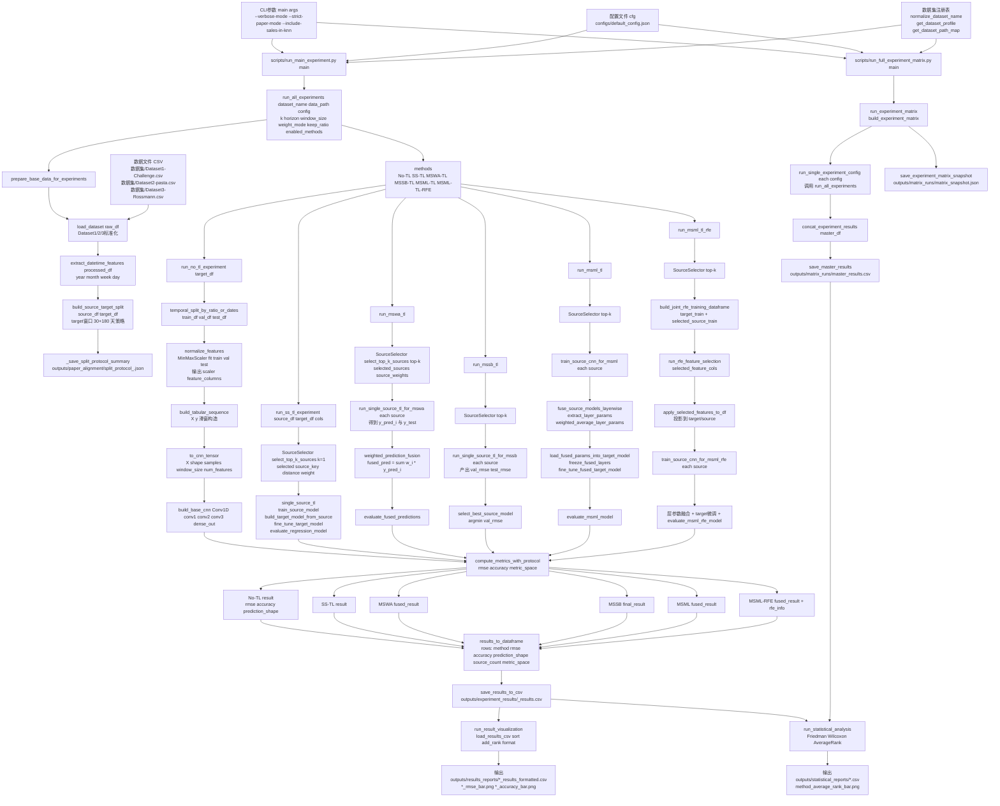

# 项目完整数据流图

基于当前代码实现梳理（输入 -> 预处理 -> 各方法分支 -> 结果输出 -> 矩阵/可视化/统计）。

```mermaid
flowchart TD
    %% ========== Inputs ==========
    I1["CLI参数 main args\n--verbose-mode --strict-paper-mode --include-sales-in-knn"]
    I2["配置文件 cfg\nconfigs/default_config.json"]
    I3["数据文件 CSV\n数据集/Dataset1-Challenge.csv\n数据集/Dataset2-pasta.csv\n数据集/Dataset3-Rossmann.csv"]
    I4["数据集注册表\nnormalize_dataset_name\nget_dataset_profile\nget_dataset_path_map"]

    %% ========== Entry ==========
    E1["scripts/run_main_experiment.py main"]
    E2["scripts/run_full_experiment_matrix.py main"]
    I1 --> E1
    I1 --> E2
    I2 --> E1
    I2 --> E2
    I4 --> E1
    I4 --> E2

    %% ========== Core Runner ==========
    R1["run_all_experiments dataset_name data_path config\nk horizon window_size weight_mode keep_ratio enabled_methods"]
    E1 --> R1
    E2 --> M1

    %% ========== Preprocessing ==========
    P1["prepare_base_data_for_experiments"]
    P2["load_dataset raw_df\nDataset1/2/3标准化"]
    P3["extract_datetime_features processed_df\nyear month week day"]
    P4["build_source_target_split\nsource_df target_df\ntarget窗口 30+180 天策略"]
    P5["_save_split_protocol_summary\noutputs/paper_alignment/split_protocol_<dataset>.json"]

    R1 --> P1
    P1 --> P2
    I3 --> P2
    P2 --> P3
    P3 --> P4
    P4 --> P5

    %% ========== Shared feature pipeline ==========
    S1["temporal_split_by_ratio_or_dates\ntrain_df val_df test_df"]
    S2["normalize_features\nMinMaxScaler fit train val test\n输出 scaler feature_columns"]
    S3["build_tabular_sequence\nX y 滑窗构造"]
    S4["to_cnn_tensor\nX shape samples window_size num_features"]
    S5["build_base_cnn Conv1D conv1 conv2 conv3 dense_out"]
    S6["compute_metrics_with_protocol\nrmse accuracy metric_space"]

    %% ========== Method branches ==========
    B0["methods\nNo-TL SS-TL MSWA-TL MSSB-TL MSML-TL MSML-TL-RFE"]
    R1 --> B0

    %% No-TL
    N1["run_no_tl_experiment target_df"]
    B0 --> N1
    N1 --> S1 --> S2 --> S3 --> S4 --> S5 --> S6
    N2["No-TL result\nrmse accuracy prediction_shape"]
    S6 --> N2

    %% SS-TL
    T1["run_ss_tl_experiment source_df target_df cols"]
    T2["SourceSelector select_top_k_sources k=1\nselected source_key distance weight"]
    T3["single_source_tl\ntrain_source_model\nbuild_target_model_from_source\nfine_tune_target_model\nevaluate_regression_model"]
    B0 --> T1 --> T2 --> T3 --> S6
    T4["SS-TL result"]
    S6 --> T4

    %% MSWA
    W1["run_mswa_tl"]
    W2["SourceSelector select_top_k_sources top-k\nselected_sources source_weights"]
    W3["run_single_source_tl_for_mswa each source\n得到 y_pred_i 与 y_test"]
    W4["weighted_prediction_fusion\nfused_pred = sum w_i * y_pred_i"]
    W5["evaluate_fused_predictions"]
    B0 --> W1 --> W2 --> W3 --> W4 --> W5 --> S6
    W6["MSWA fused_result"]
    S6 --> W6

    %% MSSB
    M2["run_mssb_tl"]
    M3["SourceSelector top-k"]
    M4["run_single_source_tl_for_mssb each source\n产出 val_rmse test_rmse"]
    M5["select_best_source_model\nargmin val_rmse"]
    B0 --> M2 --> M3 --> M4 --> M5 --> S6
    M6["MSSB final_result"]
    S6 --> M6

    %% MSML
    L1["run_msml_tl"]
    L2["SourceSelector top-k"]
    L3["train_source_cnn_for_msml each source"]
    L4["fuse_source_models_layerwise\nextract_layer_params\nweighted_average_layer_params"]
    L5["load_fused_params_into_target_model\nfreeze_fused_layers\nfine_tune_fused_target_model"]
    L6["evaluate_msml_model"]
    B0 --> L1 --> L2 --> L3 --> L4 --> L5 --> L6 --> S6
    L7["MSML fused_result"]
    S6 --> L7

    %% MSML-RFE
    RFE1["run_msml_tl_rfe"]
    RFE2["SourceSelector top-k"]
    RFE3["build_joint_rfe_training_dataframe\ntarget_train + selected_source_train"]
    RFE4["run_rfe_feature_selection\nselected_feature_cols"]
    RFE5["apply_selected_features_to_df\n投影到 target/source"]
    RFE6["train_source_cnn_for_msml_rfe each source"]
    RFE7["层参数融合 + target微调 + evaluate_msml_rfe_model"]
    B0 --> RFE1 --> RFE2 --> RFE3 --> RFE4 --> RFE5 --> RFE6 --> RFE7 --> S6
    RFE8["MSML-RFE fused_result + rfe_info"]
    S6 --> RFE8

    %% ========== Aggregation output ==========
    O1["results_to_dataframe\nrows: method rmse accuracy prediction_shape source_count metric_space"]
    O2["save_results_to_csv\noutputs/experiment_results/<dataset>_results.csv"]
    N2 --> O1
    T4 --> O1
    W6 --> O1
    M6 --> O1
    L7 --> O1
    RFE8 --> O1
    O1 --> O2

    %% ========== Matrix pipeline ==========
    M1["run_experiment_matrix\nbuild_experiment_matrix"]
    M3A["run_single_experiment_config each config\n调用 run_all_experiments"]
    M4A["concat_experiment_results master_df"]
    M5A["save_master_results\noutputs/matrix_runs/master_results.csv"]
    M6A["save_experiment_matrix_snapshot\noutputs/matrix_runs/matrix_snapshot.json"]
    M1 --> M3A --> M4A --> M5A
    M1 --> M6A

    %% ========== Visualization & Stats ==========
    V1["run_result_visualization\nload_results_csv sort add_rank format"]
    V2["输出\noutputs/results_reports/*_results_formatted.csv\n*_rmse_bar.png *_accuracy_bar.png"]
    S7["run_statistical_analysis\nFriedman Wilcoxon AverageRank"]
    S8["输出\noutputs/statistical_reports/*.csv\nmethod_average_rank_bar.png"]
    O2 --> V1 --> V2
    O2 --> S7 --> S8
    M5A --> S7
```
