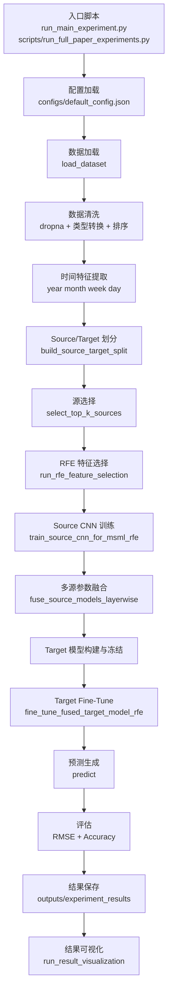
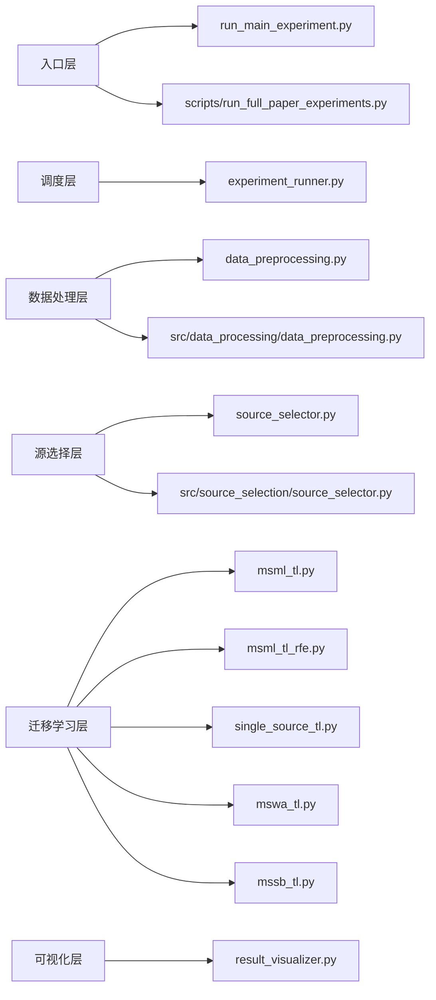

# Full Code Walkthrough Visual Index

本文档是 [docs/full_code_walkthrough.md](docs/full_code_walkthrough.md) 的“读图版索引”。

适合以下使用方式：

1. 先看全局流程图，理解从原始数据到 RMSE 的主干路径
2. 再看模块地图，定位每一步对应的代码文件
3. 最后按导航表跳回完整审阅文档逐节阅读

---

## 1. 一页总览

---

## 2. 模块地图

---

## 3. 从原始数据到 RMSE 的最短理解路径

### 路径 A：先看“数据怎么变”

1. [docs/full_code_walkthrough.md](docs/full_code_walkthrough.md) 的第 2 节 Dataset Loading
2. [docs/full_code_walkthrough.md](docs/full_code_walkthrough.md) 的第 3 节 Data Cleaning
3. [docs/full_code_walkthrough.md](docs/full_code_walkthrough.md) 的第 4 节 Datetime Feature Extraction
4. [docs/full_code_walkthrough.md](docs/full_code_walkthrough.md) 的第 5 节 Source / Target Split

### 路径 B：先看“模型怎么训练”

1. [docs/full_code_walkthrough.md](docs/full_code_walkthrough.md) 的第 6 节 Source Selection
2. [docs/full_code_walkthrough.md](docs/full_code_walkthrough.md) 的第 7 节 Feature Selection (RFE)
3. [docs/full_code_walkthrough.md](docs/full_code_walkthrough.md) 的第 8 节 Source CNN Training
4. [docs/full_code_walkthrough.md](docs/full_code_walkthrough.md) 的第 9 节 Multi-Source Parameter Fusion
5. [docs/full_code_walkthrough.md](docs/full_code_walkthrough.md) 的第 10 节 Target Fine-Tuning

### 路径 C：先看“结果怎么出来”

1. [docs/full_code_walkthrough.md](docs/full_code_walkthrough.md) 的第 11 节 Prediction Generation
2. [docs/full_code_walkthrough.md](docs/full_code_walkthrough.md) 的第 12 节 Evaluation Metrics
3. [docs/full_code_walkthrough.md](docs/full_code_walkthrough.md) 的第 13 节 Result Saving
4. [docs/full_code_walkthrough.md](docs/full_code_walkthrough.md) 的第 14 节 Result Visualization

---

## 4. 关键函数导航

| 阶段 | 核心函数 | 主要文件 | 作用 |
|---|---|---|---|
| 入口 | `main` | run_main_experiment.py | 启动单实验 |
| 统一调度 | `run_all_experiments` | experiment_runner.py | 调度各方法 |
| 数据加载 | `load_dataset` | data_preprocessing.py | 读取并标准化三个数据集 |
| 清洗 | `load_dataset` 内部 | data_preprocessing.py | dropna、转时间、排序 |
| 时间特征 | `extract_datetime_features` | data_preprocessing.py | 生成 year/month/week/day |
| 域划分 | `build_source_target_split` | data_preprocessing.py | 生成 source_df/target_df |
| 选源 | `select_top_k_sources` | source_selector.py | 选 top-k 相似源 |
| 距离 | `compute_euclidean_distances` | source_selector.py | 计算欧式距离 |
| RFE | `run_rfe_feature_selection` | msml_tl_rfe.py | 选特征子集 |
| 源训练 | `train_source_cnn_for_msml_rfe` | msml_tl_rfe.py | 训练单个 source CNN |
| 融合 | `fuse_source_models_layerwise` | msml_tl.py | 按权重融合 conv 层参数 |
| 冻结/微调 | `fine_tune_fused_target_model_rfe` | msml_tl_rfe.py | 在 target 上微调 |
| 评估 | `evaluate_msml_rfe_model` | msml_tl_rfe.py | 输出 rmse/accuracy |
| 保存 | `save_results_to_csv` | experiment_runner.py | 写结果 CSV |
| 可视化 | `run_result_visualization` | result_visualizer.py | 生成排名表和图 |

---

## 5. 最关键的 5 条调用链

### 单实验主链

`main()`
→ `run_all_experiments()`
→ `prepare_base_data_for_experiments()`
→ `run_msml_rfe_experiment()`
→ `results_to_dataframe()`
→ `save_results_to_csv()`
→ `run_result_visualization()`

### 数据主链

`load_dataset()`
→ `extract_datetime_features()`
→ `build_source_target_split()`
→ `temporal_split_by_ratio_or_dates()`
→ `normalize_features()`
→ `build_tabular_sequence()`

### 选源主链

`select_top_k_sources()`
→ `build_target_signature()`
→ `build_source_signatures()`
→ `compute_euclidean_distances()`
→ `compute_source_weights()`

### MSML-TL-RFE 主链

`run_msml_tl_rfe()`
→ `run_rfe_feature_selection()`
→ `train_source_cnn_for_msml_rfe()`
→ `fuse_source_models_layerwise()`
→ `fine_tune_fused_target_model_rfe()`
→ `evaluate_msml_rfe_model()`

### 结果主链

`results_to_dataframe()`
→ `save_results_to_csv()`
→ `run_result_visualization()`
→ `plot_rmse_bar_chart()`
→ `plot_accuracy_bar_chart()`

---

## 6. 读图建议

如果你的目标是快速建立直觉，建议按这个顺序阅读：

1. 先看本文件第 1 节“一页总览”
2. 再看本文件第 4 节“关键函数导航”
3. 最后跳转到 [docs/full_code_walkthrough.md](docs/full_code_walkthrough.md) 对应章节看细节

如果你的目标是排查数值偏差，建议优先看：

1. 数据清洗与归一化
2. Source/Target 划分
3. RFE 选特征
4. RMSE 计算位置

对应完整说明都在 [docs/full_code_walkthrough.md](docs/full_code_walkthrough.md)。