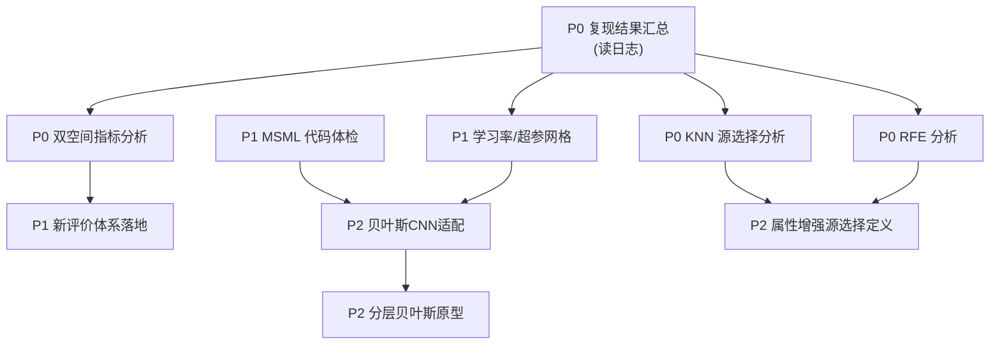

# 冷启动商品需求预测研究：任务重排与执行规划（2026-06-15 修订版）

> 本文在 `task_backlog_analysis.md`、`任务流程和优先级规划.pdf`、`关于小样本冷启动商品需求预测研究方向的讨论整理稿.docx` 基础上，
> 结合最新口头指示重新梳理。**与旧版的核心差异**：
> 1. 库存决策**暂时下线**，不作为当前推进重点；
> 2. 不再追求"完整复现原论文"，转向**先定超参（学习率等）+ 优化 MSML 系列模型**；
> 3. 评价体系**不强制与原论文口径对齐**，优先做"直观可解释"的准确度/误差；
> 4. 重点解决**归一化空间 vs 原始空间指标差异分析**；
> 5. "属性增强源选择"先**明确定义**，作为**可对比方向**而非默认采用，且非最紧急；
> 6. 探索 **MSML 与贝叶斯 CNN 的适配 + 分层贝叶斯（分层源）思想**。

---

## 0. 实验日志可用性核查结论（已完成）

路径 `outputs/runs/` 下共 **17 个有效 run**，每个 `experiment_results/paper_results.csv` 均为完整 36 行
（Dataset1/2/3 × {No-TL, SS-TL, MSWA-TL, MSSB-TL, MSML-TL, MSML-TL-RFE} × {with / without information_sharing}）。

| 结论 | 说明 |
|------|------|
| ✅ 日志完整可用 | 最新 `20260611_165932` 可作为**基准 run**；早期 run 可作复现稳定性对照 |
| ✅ 双空间指标已存在 | 每行同时含 `normalized_rmse/accuracy/mae` 与 `original_scale_rmse/accuracy/mae`，**归一化↔原始空间分析无需重训** |
| ✅ 源选择细节已存在 | `selected_source_*`、`*_distances`、`*_weights_raw/normalized`、`knn_resolved_features` 等字段完整，KNN 分析可直接做 |
| ✅ RFE 细节已存在 | `rfe_candidate_features` / `rfe_selected_features` / `rfe_removed_features` 三列齐全 |
| ⚠️ extended_results.csv 为空 | 仅表头，扩展实验（>5 源等）尚未跑 |
| ⚠️ 超参审计脚本有、输出无 | `scripts/audits/cnn_lr_clipnorm_ablation.py`、`cnn_lr_epoch_grid_ablation.py`、`cnn_stability_factorial_ablation.py` 已存在，但 `outputs/runs/*/audits` 里**没有对应的 LR/epoch 网格结果**，需要补跑 |

> **关键发现（指标口径）**：日志里的 `accuracy` 实际上 = `1 / RMSE`（已核对：Dataset1 No-TL `rmse=0.4967 → accuracy=2.013`；原始空间 `rmse=37.26 → accuracy=0.0268`）。
> 这是一个**随量纲变化、不直观**的指标——正好印证了你"希望换成更易解释的评价体系"的判断。

---

## 1. 当前已完成（更新）

| 模块 | 状态 | 位置 |
|------|------|------|
| 实验配置/环境 | ✅ | `config.yaml`、`src/utils/` |
| CNN 主干 | ✅（确定性，非贝叶斯） | `cnn_model.py`（3 层 Conv1D，Adam，lr=0.001） |
| MSML 系列模型 | ✅ 代码齐全 | `msml_tl.py`(803) / `msml_tl_rfe.py`(1351) / `mswa_tl.py`(540) / `mssb_tl.py`(535) / `single_source_tl.py` |
| KNN 源选择 | ✅ | `source_selector.py`（含 distance / weight / feature 字段输出） |
| RFE 特征选择 | ✅ | `msml_tl_rfe.py` 内置，日志含三类特征列 |
| Dataset1/2/3 复现实验 | ✅ 结果已落盘 | `outputs/runs/20260611_165932/` |
| 双空间指标记录 | ✅ | `paper_results.csv` 同时含归一化与原始空间 |
| CNN 超参审计**脚本** | ✅（未产出结果） | `scripts/audits/cnn_lr_*` |

---

## 2. 仍缺失的内容（按新优先级重排）

### 🔴 P0 — 立即（纯整理/分析，不需重训）

| # | 缺失项 | 数据来源 | 产出 |
|---|--------|----------|------|
| A1 | **复现结果汇总表** | 17 个 run 的 `paper_results.csv` | `reproduction_summary.md/csv`（含跨 run 稳定性） |
| A2 | **归一化 vs 原始空间指标差异分析** | 现有日志双空间列 | `metric_space_analysis.md` + 新评价体系建议 |
| A3 | **KNN 源选择敏感性分析** | `selected_source_*` 字段 | `knn_source_selection.md` |
| A4 | **RFE 特征选择分析** | 三类特征列 | `rfe_feature_selection.md` |

### 🟠 P1 — 本周（需补跑，但范围小）

| # | 缺失项 | 说明 | 产出 |
|---|--------|------|------|
| B1 | **学习率/超参网格结果** | 跑现有 `cnn_lr_epoch_grid_ablation.py` 等，定出较优 LR/epoch/clipnorm/batch | `hyperparameter_tuning.md` |
| B2 | **MSML 系列代码体检** | 4 个 MSML 文件一致性/冗余/可优化点核查 | `msml_code_review.md` |
| B3 | **新评价体系落地** | 在 metrics 中加入直观指标（见 §5） | 代码 + 复算表 |

### 🟡 P2 — 下周（方法探索）

| # | 缺失项 | 说明 |
|---|--------|------|
| C1 | **MSML × 贝叶斯 CNN 适配评估** | 判断现有确定性 CNN 改贝叶斯/MC-dropout 的可行性 |
| C2 | **分层贝叶斯（分层源）原型** | 把"学习源分层"落成可验证的小实验 |
| C3 | **"属性增强源选择"定义澄清** | 明确含义，设计成对比项（见 §6） |
| C4 | **文献矩阵** | 新品/冷启动/迁移学习，20+ 篇 |

### ⚪ 暂时下线 / 延后

| 项 | 处理 |
|----|------|
| 库存决策模块（旧 #16） | **暂停**，按你指示当前不推进 |
| 库存应用文献（旧 #11） | 延后 |
| 完整论文复现对齐（绝对日期边界等） | **不再作为目标**，仅保留 PARTIAL 说明即可 |

---

## 3. 下一步安排与执行顺序

**执行顺序（建议三线并行 → 收敛）**：

1. **线 1（分析，可立即并行，零训练成本）**：A1 → A2 / A3 / A4
2. **线 2（超参与代码，本周）**：B1（补跑 LR 网格）+ B2（MSML 体检）→ B3（评价体系落地）
3. **线 3（文献，背景并行）**：C4 持续推进

> 你问的"先在原有实验内跑，还是改好模型再跑？"——**答案：先用现有日志做完 P0 分析（不跑），再用 B1 小网格把 LR 等超参定下来，最后才大改 MSML**。
> 你问的"程序改动 / 文字 / 文献能否三线并行？"——**可以**：P0 分析（文字）+ B1/B2（程序）+ C4（文献）互不依赖。

---

## 4. 优先级总表

| 任务 | 优先级 | 是否需训练 | 依赖 |
|------|--------|-----------|------|
| A1 复现汇总 | 🔴 P0 | 否 | — |
| A2 双空间指标分析 | 🔴 P0 | 否 | A1 |
| A3 KNN 源选择分析 | 🔴 P0 | 否 | A1 |
| A4 RFE 分析 | 🔴 P0 | 否 | A1 |
| B1 学习率/超参网格 | 🟠 P1 | 是（小） | — |
| B2 MSML 代码体检 | 🟠 P1 | 否 | — |
| B3 新评价体系落地 | 🟠 P1 | 否（复算） | A2 |
| C1 贝叶斯 CNN 适配 | 🟡 P2 | 是 | B1,B2 |
| C2 分层贝叶斯原型 | 🟡 P2 | 是 | C1 |
| C3 属性增强源选择定义 | 🟡 P2 | 部分 | A3,A4 |
| C4 文献矩阵 | 🟡 P2 | 否 | — |
| 库存模块 | ⚪ 暂停 | — | — |

---

## 5. 专题：归一化空间 vs 原始空间指标（你的重点）

### 现状（已从日志确认）
- 主指标 `rmse/accuracy/mae` 当前默认取**归一化 MinMax 空间**；`original_scale_*` 为诊断列。
- `accuracy = 1/RMSE`：**随量纲漂移、不直观**（Dataset3 原始空间 accuracy≈0.0002，几乎不可读）。
- 三个数据集量纲差异巨大：原始空间 RMSE，Dataset1≈15–37、Dataset2≈4–9、Dataset3≈3800–9200 → **不可跨数据集直接比较**。

### 建议的新评价体系（不必对齐原论文）
| 指标 | 公式 | 优点 |
|------|------|------|
| **MAE / RMSE（原始空间）** | 反归一化后计算 | 单位=件/销量，最直观 |
| **MAPE / sMAPE** | 相对误差 | 跨数据集可比、易解释 |
| **WAPE（加权绝对百分误差）** | Σ\|y-ŷ\| / Σ\|y\| | 对零值稳健，零售常用 |
| **相对提升 %** | vs No-TL 基线 | 直接表达"迁移带来多少改善" |

> 落地方式：在 `src/evaluation/metrics.py` 增加 MAPE/sMAPE/WAPE 与"原始空间主指标"开关，
> 用现有预测结果**复算**即可（A2→B3），论文里以"原始空间 + 相对提升"为主表，归一化指标放附录。

---

## 6. 专题：MSML 整理优化 + 贝叶斯 / 分层源

### 6.1 MSML 系列体检（B2）重点
- `msml_tl.py`(803) 与 `msml_tl_rfe.py`(1351) 的**公共逻辑抽取**，避免两套实现漂移；
- `mswa_tl`(加权平均) / `mssb_tl`(共享主干) / `msml_tl`(多层) 三者的**迁移层定义是否一致、可对比**；
- 检查 source weight 归一化、冻结层策略（`set_trainable_layers`）、early stopping 是否统一。

### 6.2 学习率等超参（B1）
- 现状：`config.yaml` 写 epochs=100/lr=0.001/batch=32，但 `cnn_model.py` 默认 lr=0.001；audit 变体提供 lr=1e-4 + clipnorm=1.0。
- 行动：跑 `cnn_lr_epoch_grid_ablation.py` + `cnn_lr_clipnorm_ablation.py`，在小样本设定下定出**较优 LR / epoch / clipnorm / batch**，作为之后所有 MSML 实验的统一基线。

### 6.3 贝叶斯 CNN 适配（C1）—— 可行性判断
- 现状 `cnn_model.py` 为**确定性 1D-CNN**，不含任何贝叶斯成分。
- 低成本路径：**MC-Dropout**（已有 dropout_rate=0.2 配置位）→ 推理多次采样得预测分布，几乎不改结构即可给出不确定性。
- 中成本路径：换 `tfp`（TensorFlow Probability）的 `DenseFlipout/Conv1DFlipout`，得到权重后验。
- **建议先做 MC-Dropout**，验证"输出不确定性"能否服务于后续库存/置信区间，再决定是否上 TFP。

### 6.4 分层贝叶斯 / 分层源（C2）—— 价值点但未验证
- 思路：把"学习源"按层级组织（如 区域→门店→商品 / 品类→品牌→单品），
  让源权重服从**分层先验**（上层共享、下层个体），契合迁移学习"分层共享信息"的直觉。
- 与 MSML 的天然契合：MSML 本就是"多源多层"，可把当前的扁平 KNN 加权升级为**分层加权**。
- 先做**小原型**（单数据集、固定超参）验证：分层加权 vs 扁平加权，看 RMSE/WAPE 是否改善。

---

## 7. 专题："属性增强源选择"定义澄清（C3）

> 你的要求：先明确含义，作为**可对比方向**，而非默认采用；非最紧急。

**初步定义（待确认）**：当前 KNN 源选择主要基于销量/促销/时间等序列特征的距离。
"属性增强源选择"指在相似度计算中**显式纳入商品/门店静态属性**（类别、品牌、价格、区域、店型等），
使"为什么两个商品相似"具有可解释依据，而非仅靠销量形状匹配。

**对比实验设计（而非默认采用）**：
| 变体 | 源选择依据 |
|------|-----------|
| S0 随机源 | 随机 |
| S1 销量距离（现状） | 仅时序特征 KNN |
| S2 属性距离 | 仅静态属性 |
| S3 属性增强（S1+S2 融合） | 时序 + 属性加权 |

> 依赖：需要**属性更丰富的数据集**（Dataset3 已有 store_type/region 等，可先试；M5/Favorita 后续补）。
> 故 C3 的完整版要等数据集就绪，先在 Dataset3 上做最小可行对比。

---

## 8. 最终可交付成果形式

| 交付物 | 格式 | 来源 | 说明 |
|--------|------|------|------|
| `reproduction_summary.md/csv` | MD+CSV | A1 | 17 run 汇总 + 稳定性 |
| `metric_space_analysis.md` | MD | A2 | 双空间差异 + 新评价体系论证 |
| `knn_source_selection.md` | MD | A3 | 源选择敏感性 |
| `rfe_feature_selection.md` | MD | A4 | 特征选择规律 |
| `hyperparameter_tuning.md` | MD | B1 | 推荐 LR/epoch/clipnorm/batch |
| `msml_code_review.md` | MD | B2 | MSML 优化清单 |
| 新版 `metrics.py` + 复算表 | 代码+CSV | B3 | MAPE/sMAPE/WAPE/相对提升 |
| `bayesian_cnn_feasibility.md` | MD | C1 | MC-Dropout/TFP 路线 |
| `hierarchical_source_prototype/` | 代码+结果 | C2 | 分层加权原型对比 |
| `attribute_enhanced_selection_design.md` | MD | C3 | 定义 + S0–S3 对比方案 |
| `literature_matrix.xlsx` | Excel | C4 | 20+ 篇 |

---

## 9. 风险与提醒

- ⚠️ **超参先定再大改**：不要在 LR/epoch 未定的情况下改 MSML 结构，否则无法判断改进来源。
- ⚠️ **评价体系先定**：A2/B3 应在跑新实验前完成，保证后续所有结果用统一、直观口径。
- ⚠️ **分层贝叶斯属探索性**：先小原型证伪/证明，再决定是否纳入主线，避免实验矩阵膨胀。
- ⚠️ **属性增强依赖数据**：完整对比需属性丰富数据集，先用 Dataset3 做最小验证。
